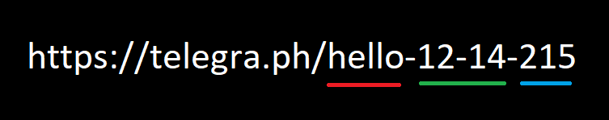
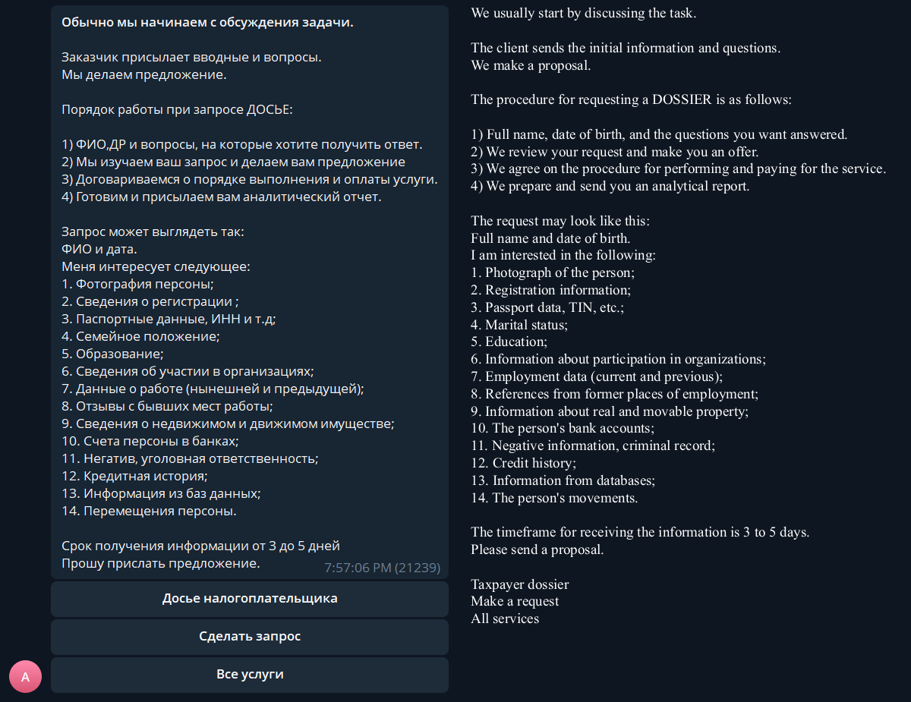
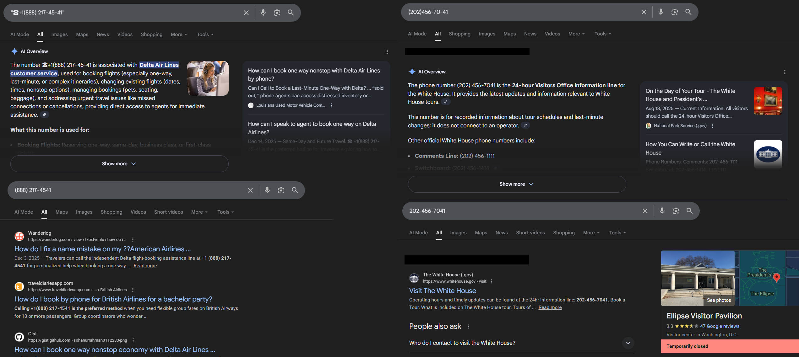

<!-- markdownlint-disable no-inline-html -->
I've recently been doing some research regarding Telegram for work.
This eventually led me to their sister platform, [Telegra.ph](https://telegra.ph).

## What is Telegra.ph?

Simply put, Telegraph is a closed-source, minimalist, Pastebin-like site that allows anyone publish text-based content.
And in their own words, the platform "is a minimalist publishing tool that allows you to create rich formatted posts and push them to the Web in just a click" [[1](https://telegra.ph/api)].
No account is required to post, but Telegraph does integrate with Telegram using the [@telegraph](https://t.me/telegraph) bot for mangaging posts.

## Finding Telegraph Posts

Unlike other paste sites, Telegraph provides no native search functionality (such as [Pastebin search](https://pastebin.com/search)).
This makes it much more difficult to find content on the site.
However, Google does index this content relatively well and can be found with [simple dorks](https://www.google.com/search?q=site%3Atelegra.ph).

While Google dorks can find a decent amount of content, it won't be able to find every post due to the site not being easily crawlable.
So, what is the next logical solution?
Web scraping.

### Post URLs

First, let's understand how a Telegraph post URL works so an algorithm can be created.

Take the following URL as an example: [https://telegra.ph/hello-12-14-215](https://telegra.ph/hello-12-14-215)

This URL has three main components: base, date, and incrementor.
The "base" is usually just the post title (truncated to 128 characters) unless it is in Russian, then it is first [transliterated](https://en.wikipedia.org/wiki/Transliteration#:~:text=Transliteration%20is%20the%20attempt%20to%20represent%20the%20text%20of%20one%20language%20in%20the%20writing%20system%20of%20another.) ([for example](https://telegra.ph/moya-istoriya-11-28-5)).
The "date" is then the current UTC month (MM) and day (DD) appended to the title; the year is not present in the component.
Then finally, the "incrementor" component allows an unlimited number of posts to share the same base and date.
It simply counts up, starting from two.


<a href="https://telegra.ph/hello-12-14-215" target="_blank">
</img>
</a>


### Scraping Methodology

During previous research and web scraping of the Telegram platform, it became apparent very quickly that the majority of unauthenticated web endpoints either have extremely relaxed rate limits or no ratelimiting at all.
This makes bruteforcing a subset of possible URLs reasonable.

Using a custom-built scraper with 100 async HTTP clients to scrape content, it took roughly six days to bruteforce all one, two, and three character combinations.
In addition to this, all valid posts had a depth search conducted on them to check for more content.

With this base dataset of roughly six million posts, 15.7 million new, unique posts were extracted from post content.

## What is actually posted on Telegraph?

The majority of content falls under a few categories.

- Spam
- Content Bypass
- Parasite SEO

### Spam

Since Telegraph doesn't require an account or even completing a Capcha to post, the majority of content technically falls under spam, but there are larger campaigns that can be picked out.

#### Space Malware

Space Malware is probably one of the most prominent spam campaigns occuring during 2023.
For roughly nine months, two different channels were promoted, t.me/spacemalware and a private channel invite link.
Of all posts that have a URL of three or fewer characters, Space Malware compromises roughly 5% of all posts, totaling 386,496.

However, at some point after this campaign, the channel was either banned or deleted.
This allowed me to claim the username onto [a new channel](https://t.me/spacemalware), meaning I now am responsible for a channel with over 300,000 backlinks.

The private invite link ([https://t.me/+YztOEovieQIzZjY8](https://t.me/+YztOEovieQIzZjY8)) still exists and links to a Russian language channel that occasionally posts about malware or other cybersecurity news.

#### The "Russian Dossier"

The RuDossier service is the second most prominent poster on Telegraph with at least 161,583 posts (URLs three or fewer characters).
While a rabbit hole in of itself, the site is similar to Doxbin if they offered services directly.
People are able to pay for a "dossier" on an individual, this can include finding their address, VIN, or official documents.
This information is then published to Telegraph as an extortion tactic.

The service is prolific enough that a [Telegram channel](https://t.me/rudossier_tg) dedicated to teaching people how to take down these Telegraph posts exists.
Dorking on both [Google](https://www.google.com/search?q=site:telegra.ph+intext:%22@rudossier%22) and [Yandex](https://yandex.com/search/?text=site%3Atelegra.ph+intext%3A%22%40rudossier%22) reveal an almost infinite amount of posts containing various personal information.

The channel advertised in the majority of their posts is now banned.
However, they seem to operate a simple website (rudossier[.]com; [archive](https://archive.ph/wNA3P)) that directs you to a new Telegram bot [@DossierSolutionsServices_bot](https://t.me/DossierSolutionsServices_bot).
The bot allows users to purchase various "dossier" services.


 

RU Dossier Bot

 
<a href="./images/ru-dossier-bot-message.png" target="_blank">
</img>
</a>

 


### Content Bypass

While it may be hard to believe, Telegram does ban and restrict channels that post certain types of content, especially NSFW and copyrighted/pirated content.
To get around this, some movie pirating bots posted their search results to Telegraph.
This works surprisingly well as Telegraph supports Telegram's in-app quick view.
Meaning, it never even seems to the end user that they are leaving the platform.

[For](https://telegra.ph/a-01-10-2) [example](https://telegra.ph/a-01-06-5), various "mdisk" bots have tens of thousands of posts linking to various pirated Indian movies primarily hosted on Terabox, a Chinese cloud storage service.

Another example is the Yama Marketplace.
Market channels and groups on Telegram traditionally just allow users to post messages in a group (sometimes costing [stars](https://telegram.org/blog/telegram-stars#telegram-stars)).
The Yama Marketplace has opted to leverage Telegraph to host ads on behalf of users, posting to a read-only channel.


 

Yama Marketplace

 
<a href="./images/yama-marketplace-telegraph-ads.png" target="_blank">
</img>
</a>

 


At a point, Telegraph did allow hosting images and videos on their own domain instead of only allowing external image links.
This was disabled reletively quickly as the majority of content was NSFW or worse.
However, these images usually are still online and hosted on Telegraph, even if they are orphaned from their original post, or were [never associated with a post in the first place](https://github.com/ZORO2045/Upload-image-to-telegraph).

### Parasite SEO

This is probably the biggest usecase for Telegraph currently.
The scale of certain operations for referral marketing or indexing malicious content is almost unfathomable.

#### WMLogs

The operator of the WMLogs spam/SEO campaign might be the number one poster on the entire platform of Telegraph.
At time of writing, I have identified over **2.9 million posts** ([example](https://telegra.ph/bluse-mit-v-ausschnitt-schicke-blusen-mit-v-ausschnitt-und-kn%c3%b6pfen-f%c3%bcr-damen-locker-sitzende-oberteile-f%c3%bcr-herbst-fr%c3%bchling-pende-09-16)) that redirect to his affiliate marketing links, which exclusively seem to be Banggood, a Chinese ecommerce site similar to Aliexpress.
Each post is complete with a title, description, usually multiple images of the product, and then up to 100 more Telegraph posts to other products.
Crawling these links quickly got out of hand and led me to arrive to 2.9m posts within a short amount of time.
I would not be surprised if this single entity has over 10m+ posts.

#### Government Documents

For this campaign, Telegraph is only one component of it.
During my day job, I am frequently sent PDF files hosted on .gov or .edu sites containing toll-free phone numbers claiming to be support or hotlines to fix various issues, usually for financial institutions.
Curious, I started to investigate how this was even possible in the first place.
It's actually quite simple, Drupal version 7 has a webform file exploit ([since 2017](https://www.securityweek.com/drupal-patches-flaw-exploited-spam-campaigns/)), where files are immediately saved to a server's public directory without needing to submit the entire form.
Many potentially vulnerable sites can be identified with a simple Shodan search [`http.html:"Drupal 7" http.html:"/webform/"`](https://www.shodan.io/search?query=http.html%3A%22Drupal+7%22+http.html%3A%22%2Fwebform%2F%22).
Other vulnerable webform plugins have been seen exploited as well, including Wordpress's [Formidable](https://formidableforms.com/) and [Ninja Forms](https://ninjaforms.com/).

Now, this is where Telegraph gets involved.
In the world of SEO, one important tactic used to rank higher on [SERP](https://www.semrush.com/blog/serp/) are backlinks.
Backlinks are simply sites and domains that link to a another site.
Early on in Google's life, people gamified backlinks and simply spammed the internet with as many links as possible.
This was caught on to and the concept of "[domain authority](https://www.monsterinsights.com/domain-authority/)" (DA) was created; this simply means that certain domains are trusted to have legitimate content more than others.
Using moz.com, a site like Github has a DA score of 96 out of 100.
Blogspot ranks slightly lower at 60.
And Telegraph somehow maintains a score of 93.
Google and other search engines trust content posted on Telegraph almost as much as Github.

With this knowledge, scammers have been leveraging Telegraph posts filled with links to these PDF files to get them indexed ([example](https://telegra.ph/sedtgszeg-12-13)).
The combination of Telegraph's high DA and the general trust associated with .gov and .edu domains allows these files to rank reletatively easily.
Telegraph posts used for this purpose can be found with dorks such as [`site:telegra.ph after:2025-12-12 intext:"pdf"`](https://www.google.com/search?q=site%3Atelegra.ph+after%3A2025-12-12+intext%3A%22pdf%22).

With these files uploaded and spread, what is the end goal?
It seems that there are two, with one potentially being an unintentional side effect.
First, simply ranking these files for longtail, organic Google searches.
A recent campaign has been targeting airlines customers regarding booking or confirmation of tickets.
For example, "How do I get a \[sic\] American booking confirmation after paying over the phone?" ([archive](https://web.archive.org/web/20251215182253/https://irvingtonnj.gov/wp-content/uploads/fsqm-files/27kgzf7Ptf4iWewwDSZGDG.pdf)).
This is a real file uploaded to a New Jersey state government site.
The actual content of the file is most likely ChatGPT generated, but it contains many variations of potential questions an airline customer may ask next to the same phone number over and over again.

The astute may have noticied that the phone numbers in the file are formatted in a strange manner.
The number always includes a phone emoji, the US country code (which is uncommon for Americans to include), and an extra dash inbetween the last four digits of the number.
This is most likely to bypass simple content filters.
However, this also has the side effect of also tricking Google's AI summary to generate excerpts confirming their legitimacy.
Searching almost any other "normal" varaition of the same phone number returns search results containing the phone number, but **never** an AI summary.
Testing any other phone number and slightly messing with the formatting allows a summary to be generated.


 
<a href="./images/google-ai-summary-comparison.png" target="_blank">
</img>
</a>
 


## Conclusion

While a free-speach platform like Telegraph sounds great in theory, it ends up being abused in almost every way imaginable.
From normal spam, to bypassing it's sister platform's TOS, to massive parasite SEO campaigns, Telegraph has it all.
