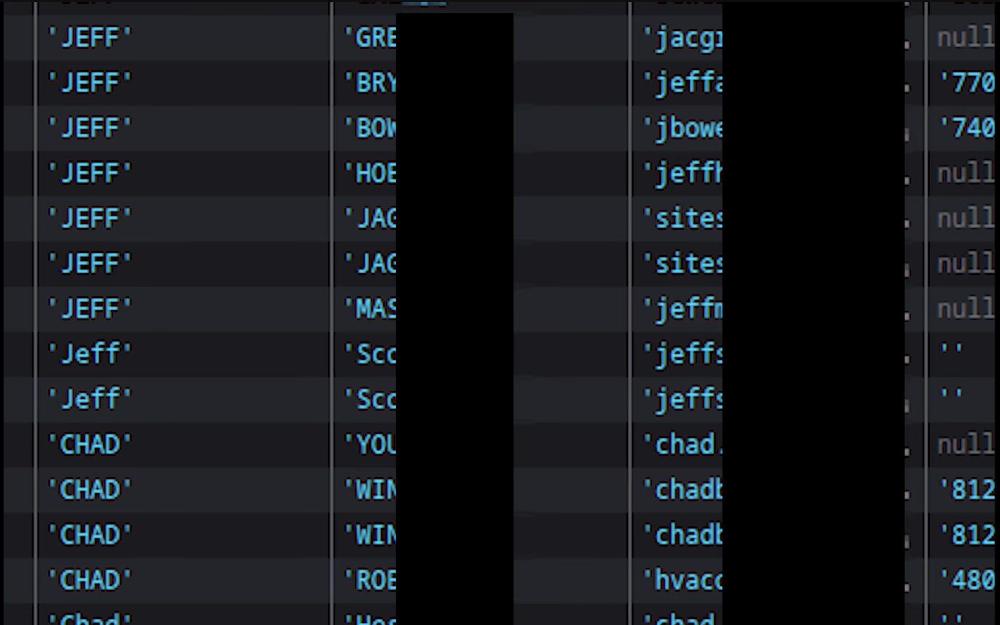

<!-- markdownlint-disable no-inline-html -->
## TLDR

For an indeterminate amount of time, the Trump Mobile API had at least two unprotected endpoints that could be exploited for either a) mass general info disclosure or b) targeted and enumerable info disclosure including plain text passwords; full PII including name, address, and email; and unique mobile device identifiers including IMEI and ICCID.

## Context

On May 19th, 2026, an unknown researcher contacted multiple social media personalities (including [coffeezilla](https://www.youtube.com/watch?v=voxXDDq58Bk) and [penguinz0](https://www.youtube.com/watch?v=c8TwGH1B5wA)) to amplify a message in an attempt to reach the Trump Mobile team.
The researcher identified multiple exploits including one information disclosure issue.
The redacted sample specifically shows rows of data with the same name (Jeff and Chad) without further PII or plaintext passwords.


 

  
Original Redacted Sample Data

    </img>
    </a>

 


## Initial Vulnerability Finding

When walking through the Trump Mobile account signup flow and capturing API calls, one specific route stood out: `api/customer/search`.
This endpoint accepted a JSON object with three properties: `action`, `email_id`, and `is_parent_only`.
The signup flow normally submits the email used in previous steps to confirm whether or not an account already exists.
However, submitting an empty string for `email_id` returned an error indicating that an email _or_ name must be included.

Using context from other API calls later in the signup flow, the fields `first_name` and `last_name` were identified.
Submitting both of these properties with generic names, such as Smith, returned a seemingly exhaustive list of every account signed up for Trump Mobile with the last name "Smith."
Searching for the first names "Jeff" and "Chad" returned data that could be correlated with the obfuscated screenshot provided by the security researcher.

This endpoint specifically returned data including: account status, internal and external customer IDs, mobile service disconnection dates (if available), email, phone number, ICCID (if available), full name, and full "service" address.

The endpoint seemingly was protected by reCAPTCHA, but the same captcha token could be used over and over again effectively making the protection useless.

As of at least May 20th, 2026 at ~11AM EST, this endpoint no longer returns customer PII.

## NextJS is Your Biggest Snitch

Not being satisfied with this singular finding, I continued to look for other API routes that were not part of the main sign up flow (which could only be completed with a purchase of almost $50).

Viewing both the front end files and the site's `robots.txt` it was very easy to identify the library used as NextJS.
From previous research, it is common for undocumented API paths to sometimes appear in front end JS chunks.
While blindly CTRL+F searching for any appearance of the word "api" a new endpoint stood out: `api/auth/customer-info`.
The surrounding function described the required JSON schema and seemingly no auth.

Querying this endpoint with a known-good internal ID from previous signup flows, it returned, in-full and in plaintext, every property about my account including plaintext password.
This endpoint returned significantly more data than previously identified with the `api/customer/search` endpoint.

### Enumerable Internal IDs

Having a small sample set of internal IDs from probing `api/customer/search` previously with common first and last names, two distinct classes were identified : `A` and `WN` users.
It is assumed that `A` stood for "active" mobile service clients and `WN` stood for "wants \[something\]" as these users did not have mobile service.
An incrementing integer was simply appended after these prefixes.

Conducting spot checks and then a small enumeration test, significant user  data was returned for IDs that had not been previously identified.

## Trump Mobile Unsung Hero

While testing endpoints, the site's API auth service kept going down.
This meant that anything requiring checking tokens or authentication simply refused to work and returned 401 errors for up to an hour at a time.
This (hopefully) significantly reduced the exfiltration window.
